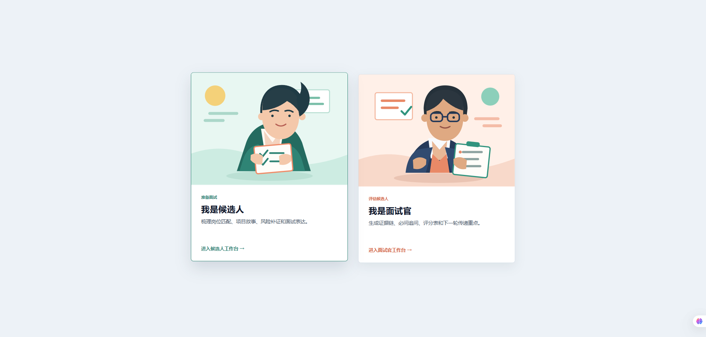
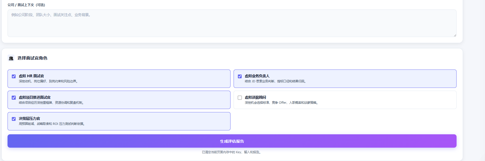
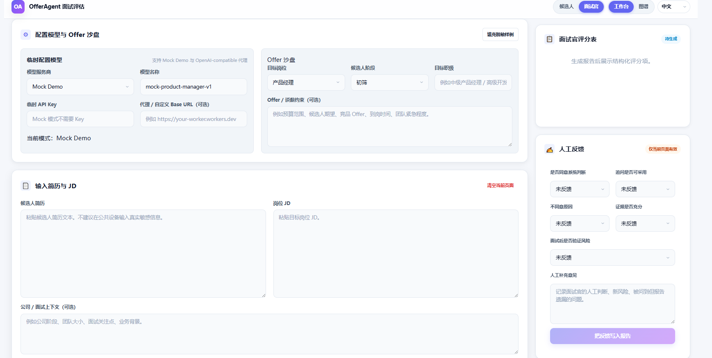
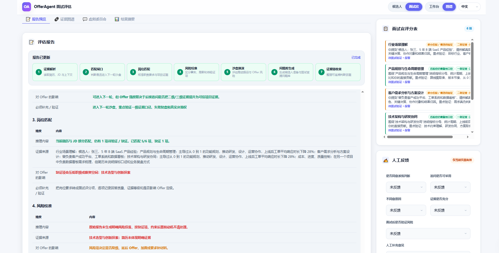
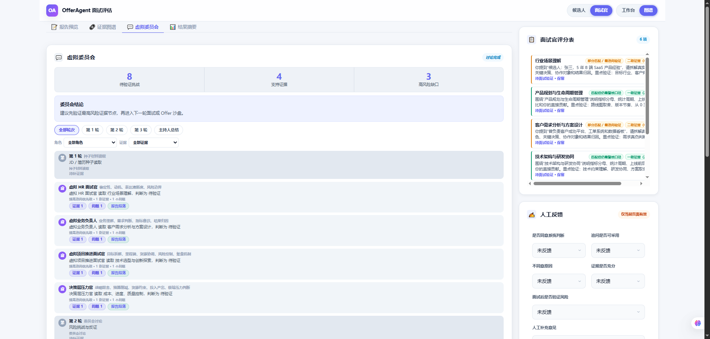
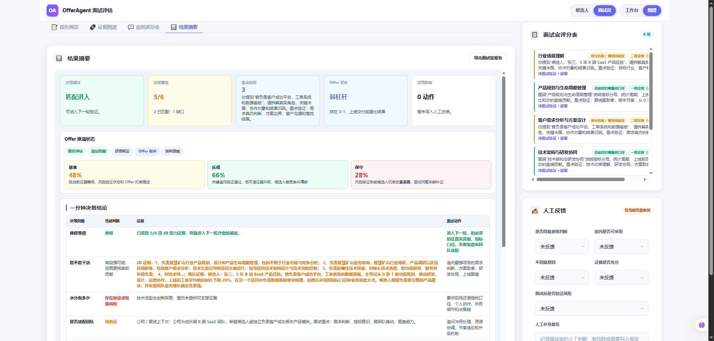
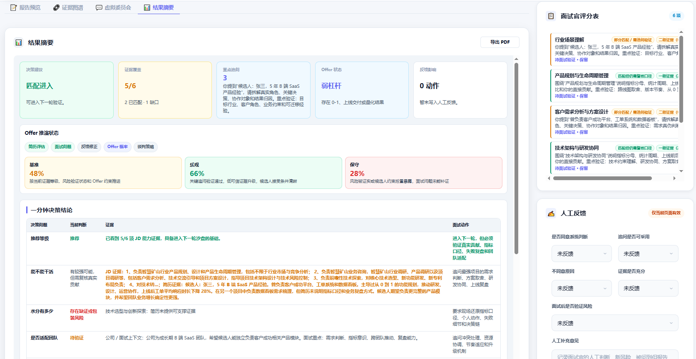

# OfferAgent Interview Evaluation Assistant

Language: [中文](README.md) | English

Repository: [https://github.com/MathsionYang/offerAgent](https://github.com/MathsionYang/offerAgent)

Live demo: [https://mathsionyang.github.io/offerAgent/](https://mathsionyang.github.io/offerAgent/)

## Screenshots















OfferAgent is a static Web MVP for interview preparation and recruiting decision support. It does not replace human hiring decisions. It turns “target role + candidate resume + job description + interview context” into traceable candidate reports, interviewer reports, offer simulations, virtual panel summaries, and an evidence graph.

The current version supports four target roles: Product Manager, Developer, Technical Support, and Sales.

## One-Line Positioning

OfferAgent helps candidates and interviewers connect role requirements with project evidence, identify risk gaps, generate follow-up questions, simulate offer paths, audit a virtual interview panel, and export structured PDF reports.

## Current Experience

1. A fixed top bar contains Workbench / Graph, Candidate / Interviewer, and Chinese / English controls.
2. The Workbench view is used for model configuration, resume input, JD input, offer constraints, and interviewer lenses.
3. Clicking Generate Report immediately switches to the Graph view while the report is generated.
4. Candidate mode hides human feedback and only exposes the candidate report export.
5. Interviewer mode shows human feedback and only exposes the interviewer report export.
6. Graph nodes can jump back to the corresponding report section.
7. The Graph view streams the virtual interview panel discussion as compact chat bubbles and keeps the moderator summary at the end.
8. The same input can reuse a cached base report to reduce repeated-generation drift.

## Core Capabilities

### 1. Project Match Gate

The system first checks whether resume projects support the JD’s core responsibilities before generating final report sections.

Current logic includes:

1. Extracting role responsibilities and capability requirements from the JD.
2. Finding project-experience anchors in the resume.
3. Labeling evidence as Level 1 / Level 2 / Level 3 credibility.
4. Producing match, conditional proceed, evidence-missing, or mismatch results.
5. Requiring additional project evidence when conclusions are unsupported.
6. Generating anti-overpackaging follow-up questions when a resume looks highly matched on the surface.

### 2. Candidate Report

The candidate report is designed for job seekers. It is not a resume beautifier. It helps candidates prepare project stories, metric definitions, contribution boundaries, failure retrospectives, and role-fit narratives.

It includes:

1. Candidate preparation priorities.
2. Resume-JD mismatch points.
3. Candidate follow-up question bank.
4. JD hidden-pain decoding.
5. Risks and pending validations.
6. Offer sandbox simulation.
7. Evidence chain and evidence gaps.

### 3. Interviewer Report

The interviewer report is designed for HR, business interviewers, technical interviewers, and hiring leads. Its goal is to improve follow-up question quality and explainability.

It includes:

1. Role hiring analysis.
2. Initial resume review.
3. Interviewer question library.
4. Interviewer handling recommendations.
5. Interviewer lens library.
6. Virtual interview panel summary.
7. Risks and pending validations.
8. Human feedback records.
9. FeedbackDistillation results.

### 4. Virtual Interview Panel

OfferAgent references MiroFish’s workflow of seed material, graph memory, persona generation, multi-round simulation, and report synthesis. The current implementation is a lightweight frontend version.

It includes:

1. `VirtualPanel`: generates virtual interviewer personas from the role, JD, resume, and selected skills.
2. `PanelDiscussionRound`: records lightweight discussion turns around evidence, risk, and offer readiness.
3. `ModeratorSummary`: summarizes consensus, disagreement, lead persona, and final recommendation.
4. `agent_persona` graph nodes: audit virtual interviewer contributions.
5. `reads_memory / discusses / challenges` graph edges: show which evidence each persona read, discussed, or challenged.
6. The Virtual Interview Panel view streams these turns as chat bubbles and keeps the full discussion history after generation.

This is not a full large-scale multi-agent simulation engine. It is a lightweight version suited to the current static Web MVP.

### 5. Consistency Mode

To make same-input reports more stable, the current version includes a consistency layer:

1. Input fingerprinting through `input_fingerprint`.
2. Structured JSON intermediate layer through `structured_evaluation`.
3. Local base-report cache reuse for identical inputs.
4. Live model calls use `temperature: 0` and include a `seed`.
5. API keys and human feedback are not stored in the base-report cache.

### 6. Interviewer Lens Library

The current version includes five SkillDefinition examples:

1. Virtual HR Interviewer.
2. Virtual Business Owner.
3. Virtual Project / PMO Interviewer.
4. Virtual Negotiation Advisor.
5. Executive Pressure Officer.

These lenses affect follow-up questions, risk judgments, virtual panel personas, and Skill contribution records in the EvidenceGraph. They will later evolve into a selectable, composable, versioned Skill Registry.

### 7. EvidenceGraph

EvidenceGraph connects JD requirements, resume evidence, questions, risks, feedback, offer signals, skills, and virtual interviewer personas into a minimal relationship graph.

Current support:

1. Node details.
2. Graph filtering.
3. Evidence-gap prompts.
4. Edge confidence / weight / source fields.
5. Node-to-report-section jump.
6. Skill output auditability.
7. Virtual interview panel auditability.

### 8. OfferSimulationRun

OfferSimulationRun has moved from a report section into a backfillable structured state.

Current support:

1. Base / Optimistic / Conservative scenario comparison.
2. Lifecycle state.
3. Run history and version metadata.
4. Backfill hints for next-round question generation, risk judgment, and negotiation strategy.

### 9. Human Feedback Loop

In Interviewer mode, human feedback can be written into the report. Feedback is connected to FeedbackDistillation rules:

1. Escalate questions.
2. Downgrade questions.
3. Delete questions.
4. Keep questions.
5. Track feedback impact on risks, offer decisions, and Skill update suggestions.

## Implemented

1. Static Web MVP.
2. Mock Demo and temporary OpenAI-compatible model configuration.
3. RoleProfiles for Product Manager, Developer, Technical Support, and Sales.
4. Candidate / Interviewer segmented mode switch.
5. Workbench / Graph dual view.
6. Chinese / English UI, sample data, reports, and PDF output.
7. Chunked streaming report output.
8. Candidate and interviewer report split.
9. Two-module PDF export.
10. EvidenceGraph display, filtering, gap detection, and report-section jump.
11. VirtualPanel, PanelDiscussionRound, ModeratorSummary, and chat-style panel streaming.
12. Consistency mode with input fingerprinting, structured intermediate state, and local cache reuse.
13. Structured Offer sandbox state.
14. FeedbackDistillation visualization.
15. GitHub Pages deployment.
16. Cloudflare Worker proxy example.
17. Static smoke test script.

## Current Limits

1. No user account, team workspace, or cloud report persistence yet.
2. No real-sample evaluation dataset yet. This is intentionally deferred for now.
3. No ATS / HRIS integration yet.
4. Skill Registry is still an example-driven frontend structure, not a complete plugin or marketplace system.
5. EvidenceGraph is a minimal usable graph, not a full knowledge-graph database.
6. The virtual interview panel is a lightweight rule-driven layer, not a full multi-agent simulation engine.
7. Frontend modularization phase 2 is complete: `apps/web/src/domain-data.js` owns role/sample/constants, `apps/web/src/run-cache.js` owns input fingerprints and run caching, and `apps/web/src/i18n.js` owns localized copy and report-progress stages; `apps/web/app.js` still owns page orchestration, reports, graph, panel, and PDF flow for the next split.

## Local Usage

Open the static page directly:

```text
apps/web/index.html
```

Or run a static server:

```bash
python -m http.server 5173 -d apps/web
```

Then visit:

```text
http://localhost:5173
```

## Verification

```bash
node --check apps/web/src/domain-data.js
node --check apps/web/src/run-cache.js
node --check apps/web/src/i18n.js
node --check apps/web/app.js
python scripts/smoke_test.py
git diff --check
```

## Privacy

Mock Demo does not call external models. In real-model mode, the API key is only used temporarily in the current browser page and is not written to the repository or the consistency cache. The cache stores base report run state only, not API keys or human feedback. Avoid entering real sensitive resume data on public or untrusted devices.
